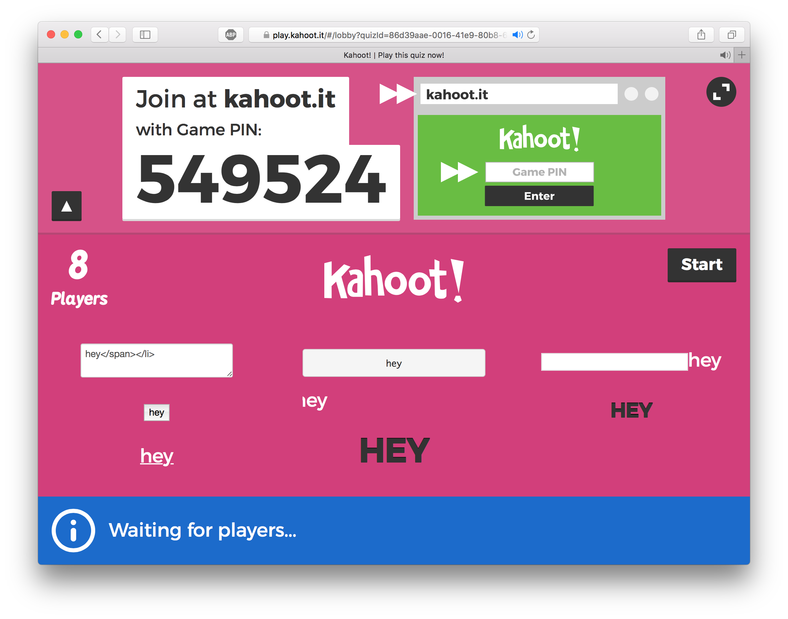

# Abstract

I have reverse engineered parts of the protocol used by [kahoot.it](http://kahoot.it). This repository contains the results of my labor.

# Included tools

Currently, I have implemented the following tools:

 * [kahoot-flood](kahoot-flood/) - using an old school denial of service technique, this program automatically joins a game of kahoot an arbitrary number of times. For instance, you can register the nicknames "alex1", "alex2", ..., "alex100".
 * [kahoot-rand](kahoot-rand/) - connect to a game an arbitrary number of times (e.g. 100) and answer each question randomly. If you connect with enough names, one of them is bound to win.
 * [kahoot-profane](kahoot-profane/) - circumvent Kahoot's profanity detector, allowing you to join with any nickname (but with extra length restrictions; it has to be short).
 * [kahoot-play](kahoot-play/) - play kahoot regularly&mdash;as if you were using the online client.
 * [kahoot-html](kahoot-html/) - I have notified Kahoot and they have fixed this issue. It used to allow you to join a game of kahoot a bunch of times with HTML-rich nicknames. This messes with the lobby of a kahoot game. See the screenshot in the [example](#example) section.
 * [kahoot-crash](kahoot-crash/) - trigger an exception on the host's computer. This no longer prevents the game from functioning, so it is a rather pointless "hack"
 * [kahoot-xss](kahoot-xss/) - since I discovered this security hole, I contacted Kahoot and they fixed it. This used to run arbitrary JavaScript code on the host's computer. This exploited a bug with the pre-game player list, which did not sanitize HTML tags. The exploit itself [was rather complicated](#the-xss-hack) due to the fact that nicknames are limited to 15 characters.

# Dependencies

First, you must have [the Go programming language](https://golang.org/doc/install) installed on your machine.

Once you have Go installed and a `GOPATH` configured, you can use the following command to install the dependencies:

    go get github.com/gorilla/websocket
    
# Android

Download [Termux](https://play.google.com/store/apps/details?id=com.termux) on Android device and type this command line:

    apt update
    apt install curl
    curl https://raw.githubusercontent.com/unixpickle/kahoot-hack/master/kh-tmux-setup.sh > kh-tmux-setup.sh
    chmod +x kh-tmux-setup.sh
    ./kh-tmux-setup.sh

# Usage

Once you have all the needed dependencies, you can run [kahoot-flood/main.go](kahoot-flood/main.go) program to execute the kahoot-flood tool. You can run the other tools in a similar fashion.

# The XSS hack

**NOTE:** I have contacted Kahoot and they have fixed this bug. It would have posed an actual security threat to teachers using Kahoot.

The XSS hack allows you to run arbitrary JavaScript code on the coordinator's computer. This could be something like `alert('hey')`, or it could be something much more devious. The command is dead-simple to use as well; you can do something like `go run kahoot-xss/main.go game-pin alert\(\)`. While this seems simple enough, I had to work around some very tough restrictions to get this to work.

The exploit I use only allowed me to execute five-character snippets of JavaScript at a time. Kahoot lets users inject 15 characters of HTML, so we can do something like `<script>code`. The problem is that the client code dumps some HTML tags after our script, so if we did `<script>XXX`, it would result in an eval like `eval("XXX</li>")`. To deal with this, the last two characters of our script need to be `//` to introduce a comment. This leaves us with five characters of JavaScript per nickname.

The obvious approach is to build a script string using string concatenations and then evaluate it. The problem is that `eval(e)` is 7 characters, and even something like `e=eval` is 6 characters, one over our limit. In the end, I exploited the fact that Kahoot uses jQuery. Using HTML element construction, I can create a bogus `` that executes code (e.g. ``). Once I get this into a variable `Z`, I can do `$(Z)`.

I initially tried building strings using a linear approach: `a=''`, `b='X'`, `a+=b`, etc. In theory, this works, but in practice it took way to long to be useful. Now, I use a highly-parallel logarithmic approach. First, I set 32 variables in parallel. Then I join these variables into 16 new variables in parallel (e.g. `a=b+c`). I repeat this until all 32 characters are concatenated into one variable. I then repeat the process for the next 32 characters of the string, until I have built the whole thing.

In sum, my program takes your script and puts it in a malicious `` tag. It then builds a variable on the coordinator's browser with the contents of that tag. Finally, it puts the plan into action by invoking jQuery's conveniently short function name.

# Example

# License

This is released under the 2-clause BSD license. See [LICENSE](LICENSE).
